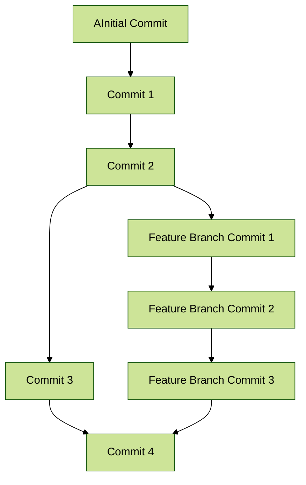

import Highlight from '@site/src/components/Highlight';
import Tabs from '@theme/Tabs';
import TabItem from '@theme/TabItem'


## <Highlight color='#004080' highlight='fg' fontWeight='bold'> Useful Git Commands </Highlight>

1. Uninitialize Git repository

```bash
cd path/to/repo
rm -rf .git
```

2. To see your initialized Git user locally

```sh
git config --list
```
{/* truncate */}

3. Drop all the changes

```sh
git stash -u && git stash drop
```

4. **Stash your changes:**
   ```sh
   git stash
   ```

   This command saves your local modifications and reverts the working directory to match the HEAD commit.

5. **Pop the most recent stash:**
   ```sh
   git stash pop
   ```

   This command applies the changes from the most recent stash and removes it from the stash list.

6. **Apply the most recent stash:**
   ```sh
   git stash apply
   ```

   This command applies the changes from the most recent stash but keeps the stash in the stash list.

These commands will operate on the most recent stash without needing to specify `stash@{0}`.
   
7. **Stash your changes with a message:**
   ```sh
   git stash push -m "my_stash_name"
   
8. **List your stashes to see the stash you just created:**
   ```sh
   git stash list
   ```
   You will see an output similar to:
   ```
   stash@{0}: On branch_name: my_stash_name
   ```
   
9. **Apply the stash:**
   ```sh
   git stash apply stash@{0}
   ```
   Replace `stash@{0}` with the appropriate stash reference if it's not the most recent one.

10. **Or pop the stash (apply and remove from stash list):**
   ```sh
   git stash pop stash@{0}
   ```
   Again, replace `stash@{0}` with the correct reference if needed.

Using `apply` will keep the stash in the list, while `pop` will remove it after applying.

11. Create a new branch from the stash:
   ```
   git stash branch <branch-name>
   ```

Replace `<branch-name>` with the desired name for your new branch. This command will create a new branch, apply the stashed changes, and drop the stash.

#### git checkout vs git switch

Both `git switch` and `git checkout` can be used to switch branches in Git, but `git switch` is a newer and more focused command introduced to simplify branch switching. Here are the differences and usage examples:

The `git checkout` command is versatile and can be used for various purposes, including switching branches, creating new branches, and checking out specific commits or files. However, its versatility can sometimes make it confusing.

12. **Switch to an existing branch:**
```sh
git checkout branch-name
```

13. **Create and switch to a new branch:**
```sh
git checkout -b new-branch-name
```

The `git switch` command is specifically designed for switching branches, making it more intuitive for this purpose. It does not support all the functionalities of `git checkout`.

14. **Switch to an existing branch:**
```sh
git switch branch-name
```

15. **Create and switch to a new branch:**
```sh
git switch -c new-branch-name
```

- Use `git switch` for a more straightforward and focused way to switch branches.
- Use `git checkout` if you need its additional functionalities, such as checking out specific commits or files.

For most branch switching tasks, `git switch` is recommended for its simplicity and clarity.

The `git log` command is used to view the commit history of a Git repository. It shows a list of commits, including their hashes, author information, dates, and commit messages. Here are some common options and their differences:

16. **Basic `git log`:**
   ```sh
   git log
   ```
   This command shows the commit history in a simple format.

17. **`git log --oneline`:**
   ```sh
   git log --oneline
   ```
   This command shows the commit history in a condensed format, with each commit on a single line. It displays the commit hash and the commit message.

18. **`git log --graph`:**
   ```sh
   git log --graph
   ```
   This command shows the commit history as a graph, which is useful for visualizing branch and merge history.

19. **`git log --stat`:**
   ```sh
   git log --stat
   ```
   This command shows the commit history along with a summary of changes made in each commit (files changed, insertions, and deletions).

20. **`git log -p`:**
   ```sh
   git log -p
   ```
   This command shows the commit history along with the actual changes (diffs) made in each commit.

21. **`git log --author="Author Name"`:**
   ```sh
   git log --author="Author Name"
   ```
   This command filters the commit history to show only commits made by a specific author.

22. **`git log --since="2022-01-01"`:**
   ```sh
   git log --since="2022-01-01"
   ```
   This command filters the commit history to show only commits made since a specific date.

23. **`git log --until="2022-12-31"`:**
   ```sh
   git log --until="2022-12-31"
   ```
   This command filters the commit history to show only commits made until a specific date.

24. **`git log --grep="keyword"`:**
   ```sh
   git log --grep="keyword"
   ```
   This command filters the commit history to show only commits with messages containing a specific keyword.

25. **Combining options:**
    ```sh
    git log --oneline --graph --decorate --all
    ```
    This command combines multiple options to show a decorated graph of the commit history, with each commit on a single line, including all branches.

These options allow you to customize the output of `git log` to suit your needs and make it easier to navigate and understand the commit history.

Here are the basic Git commands to check the status of your repository, add changes to the staging area, and commit them:

26. **Check the status of your repository:**
   ```sh
   git status
   ```

   This command will show you the current state of your working directory and staging area, including any changes that have been made, files that are staged for commit, and untracked files.

27. **Add changes to the staging area & unstaging**
   ```sh
   git add <file>
   ```

   Replace `<file>` with the path to the file you want to stage. For example, to stage the index.html file:
   ```sh
   git add src/index.html
   ```

   To stage all changes in the repository, you can use:
   ```sh
   git add .
   ```
   
   To **Unstage** all files
   ```sh
   git restore --staged .
   ```
   
   Unstage the specific file
   ```sh
   git restore --staged src/index.html
   ```

28. **Commit the staged changes:**
   ```sh
   git commit -m "Your commit message"
   ```

   Replace `"Your commit message"` with a meaningful message describing the changes you made. For example:
   ```sh
   git commit -m "Update index.html with systemjs-importmap and preload link"
   ```
   
29. **Switch to the specific commit in detached HEAD state:**
   ```sh
   git switch --detach <commit-hash>
   ```

   Replace `<commit-hash>` with the hash of the commit you want to switch to. You can inspect the state of the repository at a specific commit without creating a new branch. This is useful for debugging or reviewing the code at a particular point in time.
   
In a detached HEAD state, you can make changes and commit them, but these commits will not belong to any branch. If you want to keep these changes, you should create a new branch:

30. **Create a new branch from the detached HEAD state:**
   ```sh
   git switch -c new-branch-name
   ```

Replace `new-branch-name` with the desired name for your new branch. This will create a new branch and move your changes to it.

31. `git merge` is used to combine the changes from one branch into another. It creates a new merge commit that includes the changes from both branches.

```sh
git checkout main
git merge feature-branch
```
   
32. git rebase is a powerful Git command that allows you to move or combine a sequence of commits to a new base commit. It is often used to keep a linear commit history and to integrate changes from one branch into another.
   ```sh
   git checkout feature-branch
   git rebase main
   ```
- This command will rebase the feature-branch onto the main branch. It effectively takes the commits from feature-branch and re-applies them on top of the latest commit in main.
- During the rebase process, you might encounter conflicts. Git will pause the rebase and prompt you to resolve the conflicts.
- Identify conflicted files by `git status`

33. **Resolve conflicts manually or accept incoming changes:**
   ```sh
   git checkout --theirs <file>
   git add <file>
   ```
34. **Resolve conflicts manually or ignoring incoming changes/ keeping current changes:**
   ```sh
   git checkout --ours <file>
   git add <file> 
   ```

35. **Continue with the rebase:**
   ```sh
   git rebase --continue
   ```
   This command tells Git to continue the rebase process after resolving the conflicts.
   
36. **Abort the rebase (if needed)**: If you want to stop the rebase process and return to the original state, you can use:
   ```sh
   git rebase --abort
   ```
   
37. `git merge --squash` is used to combine the changes from one branch into another, but it does not create a merge commit. Instead, it squashes all the changes into a single commit.

```sh
git checkout main
git merge --squash feature-branch
```
38. Pull changes from the remote `master` branch to current branch

```sh
git pull origin master
```

39. **Check the differences between the working directory and the staging area:**
   ```sh
   git diff
   ```

40. **Check the differences between the staging area and the last commit:**
   ```sh
   git diff --staged
   ```

#### Breakdown of git pull origin master

1. **Fetch Changes:**
   The command first fetches the latest changes from the `master` branch of the remote repository named `origin`. This updates your local copy of the remote branch.

   ```sh
   git fetch origin master
   ```

2. **Merge Changes:**
   After fetching the changes, it merges the `master` branch from the remote repository into your current branch. This integrates the changes from the remote `master` branch into your working branch.

   ```sh
   git merge origin/master
   ```
## <Highlight color='#004080' highlight='fg' fontWeight='bold'> Mermaid Diagram </Highlight>



## Ref

1. [10 Git Commands Every Developer Should Know](https://www.freecodecamp.org/news/10-important-git-commands-that-every-developer-should-know/)
2. [Git Branching Commands Explained with Examples](https://www.freecodecamp.org/news/git-branching-commands-explained/)
3. [git commands](https://github.com/joshnh/Git-Commands)
4. [Git Branches: List, Create, Switch to, Merge, Push, & Delete](https://www.nobledesktop.com/learn/git/git-branches)
5. [git stash and git pull - Stack Overflow](https://stackoverflow.com/questions/12476239/git-stash-and-git-pull)
6. [Git Merge vs. Rebase: Key Differences](https://dev.to/codeparrot/git-merge-vs-rebase-key-differences-1pb4)
7. [How to Create Diagrams as Code with Mermaid, GitHub, and Visual Studio Code](https://www.freecodecamp.org/news/diagrams-as-code-with-mermaid-github-and-vs-code/)
8. [Creating diagrams](https://docs.github.com/en/get-started/writing-on-github/working-with-advanced-formatting/creating-diagrams)
9. [The Ultimate Git Command Cheatsheet](https://dev.to/dipakahirav/the-ultimate-git-command-cheatsheet-l31)
