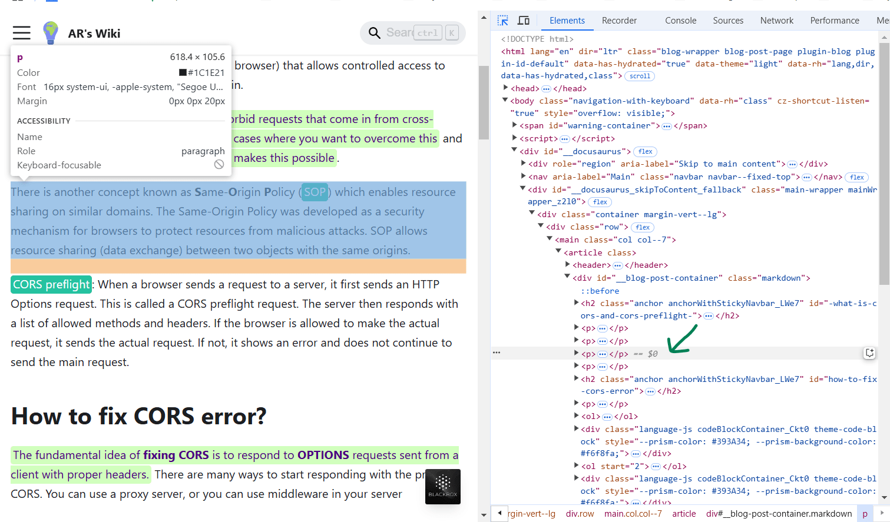
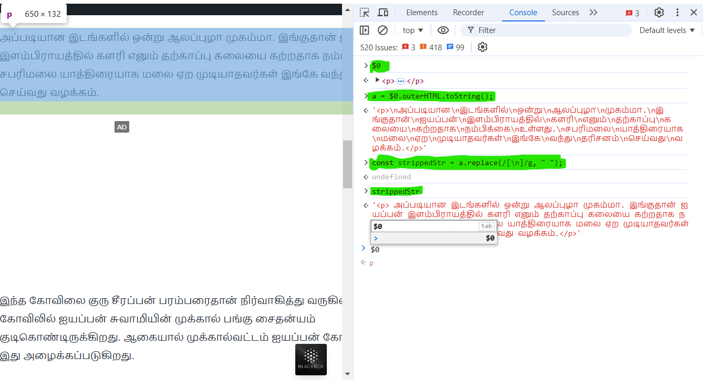

import Highlight from '@site/src/components/Highlight';
import Tabs from '@theme/Tabs';
import TabItem from '@theme/TabItem'

## <Highlight color='#800031' highlight='fg' fontWeight='bold'> How to copy a text from a website which prevents copying from UI? </Highlight>

1. Click on select option (Arrow with dotted arrow) in element tab on the console of the browser.
2. click on the UI text using select arrow as shown in the below image
3. Selected element will be stored under the variable `$0`. You can see it in the below image.

{/* truncate */}

4. You can type the variable `$0` in console tab. It'll display the selected html dom element in the console.
5. Sometimes, the selected dom element may contains html element for space or new line as shown below;

6. `$0.outerHTML` will convert html dom element into sanitized (string format) form. So `a = $0.outerHTML.toString()` is used
7. `const strippedStr = a.replace(/[\n]/g, " ");` will replace `\n` by one space character and store at a said variable.

