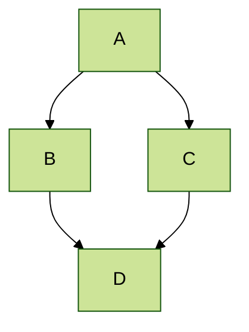

import Tabs from '@theme/Tabs';
import TabItem from '@theme/TabItem';

import Highlight from '@site/src/components/Highlight';

# Mermaid Diagram - Rough

```mermaid
%%{init: { 'theme': 'forest' } }%%
graph TD;
  A-->B;
  A-->C;
  B-->D;
  C-->D;
```